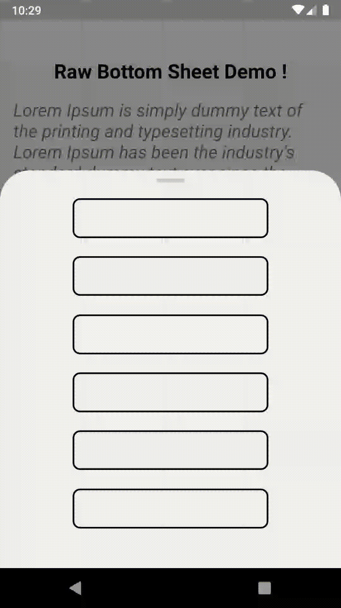

<!-- PROJECT SHIELDS -->
<!--
*** I'm using markdown "reference style" links for readability.
*** Reference links are enclosed in brackets [ ] instead of parentheses ( ).
*** See the bottom of this document for the declaration of the reference variables
*** for contributors-url, forks-url, etc. This is an optional, concise syntax you may use.
*** https://www.markdownguide.org/basic-syntax/#reference-style-links
-->

<!-- TABLE OF CONTENTS -->
## Table of Contents

* [About the Project](#about-the-project)
  * [Built With](#built-with)

<!-- ABOUT THE PROJECT -->
## About The Project

[![Product Name Screen Shot][product-screenshot]](https://example.com)

A simple react native raw bottom sheet with keyboard aware scroll view.

Here's why:
* Can be used in place of modals as a separate component
* A higher order component that wraps the views sent to it in the raw bottom sheet
* Referenced an easy to use raw-bottom-sheet (https://www.npmjs.com/package/react-native-raw-bottom-sheet)

### Built With
This section should list any major frameworks that you built your project using. Leave any add-ons/plugins for the acknowledgements section. Here are a few examples.
* [React-Native](https://reactnative.dev/)
* [raw-bottom-sheet](https://github.com/nysamnang/react-native-raw-bottom-sheet)

